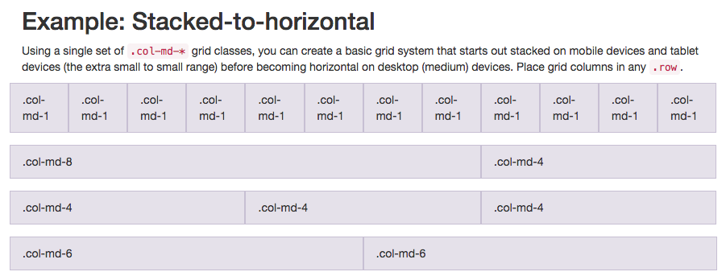

[TOC]

## Bootstrap

### 1 - 使用 Bootstrap

Bootstrap将会根据你的屏幕的大小来调整HTML元素的大小——强调响应式设计的概念。通过响应式设计，你无需再为你的网站设计一个手机版的。它在任何尺寸的屏幕上看起来都会不错。

你仅需要通过添加下列代码到你的HTML开头来将Bootstrap添加到任意应用中：

`<link rel="stylesheet" href="//cdn.bootcss.com/bootstrap/3.3.1/css/bootstrap.min.css"/>`

### 2 - 图像和标题

#### 2.1 - 令图像尺寸自动适应屏幕

在图像元素中添加一个 `img-responsive` 属性：

``

#### 2.2 - 令文本居中

在标题中添加 `text-center` 属性

`<h2 class="red-text text-center">your text</h2>`

### 3 - 按钮

Bootstrap 内置了一些按钮类，有不同大小、不同颜色的

注意它们有前置关系，`btn` 是 `btn-block` 的前置。与这两种尺寸对应的不同颜色也要以 `btn` 或 `btn btn-block` 作为前置。

#### 3.1 - 尺寸

介绍了比较窄的“.btn”和宽度占一整行的“.btn-block”

##### 3.1.1 - 行级 .btn

`<button class="btn">Like</button>`

##### 3.1.2 - 块级 .btn-block

`<button class="btn btn-block">Like</button>`

#### 3.2 - 颜色

primary 指主要操作，info 指次要操作，danger 指删除之类的操作，颜色在示例中分别是蓝色、浅蓝色、红色。

##### 3.2.1 - .btn-primary

`<button class="btn btn-primary">Like</button>`

`<button class="btn btn-block btn-primary">Like</button>`

##### 3.2.2 - .btn-info

`<button class="btn btn-info">Info</button>`

`<button class="btn btn-block btn-info">Info</button>`

##### 3.2.3 - .btn-danger

`<button class="btn btn-danger">Delete</button>`

`<button class="btn btn-block btn-danger">Delete</button>`

#### 3.3 - btn-default

`<button class="btn btn-default"></button>`

### 4 - 网格布局

Bootstrap 使用一种响应式网格布局——可轻松实现将多个元素放入一行并指定各个元素的相对宽度的需求。Bootstrap 中大多数的class属性都可以设置于 div 元素中。



图中的 `.col-md-x` 是一个 class，它定义了不同的列宽。

每一行是一个 `.row`，其中排列了若干个列。行和列都是 div 的属性，如要设置一个图中第二行的布局，代码为：

```html
<div class="row">
    <div class="col-md-8">
        <button class="btn">Like</button>
    </div>
    <div class="col-md-4">
        <button class="btn">Like</button>
    </div>
</div>
```

这里 button 元素是放置于网格布局中的东西。

在这张图表中，`col-md-*` 的 md 表示 medium (中等的)。通过此图表的属性设置可知，在中等大小的屏幕上(例如笔记本电脑)，元素的列宽被指定了。在课程的 Cat Photo App 中使用 `col-xs-*` ，其中 xs 是 extra small 缩写（应用于较小的屏幕，比如手机屏幕）。

#### 4.1 - row 行

如上。先定义行图层再再定义列图层

#### 4.2 - col 列

同上

#### 4.3 - well 深

Bootstrap 有一个 class 叫做 `well`，它的作用是为包含的网格创造出一种视觉上的深度感（凹下去的矩形）

```html
<div class="container-fluid">
    <h3 class="text-primary text-center">jQuery Playground</h3>
    <div class="row">
        <div class="col-xs-6">
            <div class="well"></div>
        </div>
        <div class="col-xs-6">
            <div class="well"></div>
        </div>
    </div>
</div>
```

### 5 - 图标

Font Awesome 是一个非常方便的图标库。这些图标都是矢量图形，被保存在 .svg 的文件格式中。这些图标就和字体一样，你可以通过像素单位指定它们的大小，它们将会继承其父HTML元素的字体大小。

#### 5.1 - 使用图标库

你可以将 Font Awesome 图标库增添至任何一个应用中，方法很简单，只需要在你的 HTML 头部增加下列代码即可：

`<link rel="stylesheet" href="//cdn.bootcss.com/font-awesome/4.2.0/css/font-awesome.min.css"/>`

#### 5.2 - 写法

`i` 元素起初一般是让其它元素有斜体(italic)的功能，不过现在一般用来指代图标。你可以将 Font Awesome 中的 class 属性添加到 `i` 元素中，把它变成一个图标，比如：

`<i class="fa fa-info-circle"></i>`

##### 5.2.1 - 点赞

`<button class="btn btn-block btn-primary">Like<i class="fa fa-thumbs-up"></i></button>`

##### 5.2.2 - 信息

`<button class="btn btn-block btn-info"><i class="fa fa-info-circle"></i>Info</button>`

##### 5.2.3 - 删除

`<button class="btn btn-block btn-danger"><i class="fa fa-trash"></i>Delete</button>`

##### 5.2.4 - 发送

`<button type="submit" class="btn btn-primary"><i class="fa fa-paper-plane"></i> Submit</button>`

### 6 - 修饰表单

你还可以将 Bootstrap 的  `col-xs-*` 用在 form 元素中。这样的话，我们的单选按钮就可以均匀地在页面上展开，不需要知道屏幕的分辨率有多宽。

下面的代码将页面中的两个单选按钮放置于一个 `row` 元素中，三个多选按钮放置于一个 `row` 元素中，然后用 `col` 元素分别包裹每一个按钮。将输入框和提交按钮也置于一个 `row` 元素，设置了提交按钮的样式和图标。

```html
<form action="/submit-cat-photo">
    <div class="row">
        <div class="col-xs-6">
            <label><input type="radio" name="indoor-outdoor"> Indoor</label>
        </div>
        <div class="col-xs-6">
            <label><input type="radio" name="indoor-outdoor"> Outdoor</label>
        </div>
    </div>
    <div class="row">
        <div class="col-xs-4">
            <label><input type="checkbox" name="personality"> Loving</label>
        </div>
        <div class="col-xs-4">
            <label><input type="checkbox" name="personality"> Lazy</label>
        </div>
        <div class="col-xs-4">
            <label><input type="checkbox" name="personality"> Crazy</label>
        </div>
    </div>
    <div class="row">
        <div class="col-xs-7">
            <input type="text" class="form-control" placeholder="cat photo URL" required>
        </div>
        <div class="col-xs-5">
            <button type="submit" class="btn btn-primary">
                <i class="fa fa-paper-plane"></i> Submit
            </button>
        </div>
    </div>
</form>
```

## jQuery

jQuery 是个 JavaScript 库。

### 1 - target

并不是每一个 class 属性都是用于 CSS 的。有些时候我们创建一些 class 只是为了更方便地在 jQuery 中选中这些元素。

`<button class="btn btn-default target"></button>`

有了 `target` 属性的元素可以被 jQuery 选中进行操作。要精确地选中它们，可以像这样为每个对象加上 ID 标签：

```html
<div class="container-fluid">
    <h3 class="text-primary text-center">jQuery Playground</h3>
    <div class="row">
        <div class="col-xs-6">
            <h4>#left-well</h4>
            <div class="well" id="left-well">
                <button class="btn btn-default target" id="target1">#target1</button>
                <button class="btn btn-default target" id="target2">#target2</button>
                <button class="btn btn-default target" id="target3">#target3</button>
            </div>
        </div>
        <div class="col-xs-6">
            <h4>#right-well</h4>
            <div class="well" id="right-well">
                <button class="btn btn-default target" id="target4">#target4</button>
                <button class="btn btn-default target" id="target5">#target5</button>
                <button class="btn btn-default target" id="target6">#target6</button>
            </div>
        </div>
    </div>
</div>
```

### 2 - 方法

#### 2.1 - 准备

在代码最上面加上

```html
<script>
$(document).ready(function() {
    这里将会写上jQuery函数
});
</script>
```

在没有document ready function以前，你的代码会在HTML没有渲染完成就执行，这样会产生bug。

#### 2.2 - 选择器

##### 2.2.1 - 元素选择器

`$("button").addClass("animated bounce");`

##### 2.2.2 - 类选择器

`$(".well").addClass("animated shake");`

##### 2.2.3 - ID选择器

`$("#target3").addClass("animated fadeOut");`

#### 2.3 - 操作元素

##### 2.3.1 - .addClass()/.removeClass() 类操作

可以操作所选择的对象的类。上面是为目标添加了动画类，令目标产生动画效果。

* addClass()

`$(".btn").addClass("btn-primary");`

* removeClass()

`$("button").removeClass("btn-default");`

##### 2.3.2 - .css() 改变CSS

`$("#target1").css("color", "red");`

这跟通常的CSS语法有点不同，这里CSS的属性和值是在引号内的，并且用逗号分开。

##### 2.3.3 - .prop() 让按钮不可选

`$("button").prop("disabled", true);`

也可以同时改变CSS和不可选：

`$("#target1").css("color", "red").prop("disabled", true);`

##### 2.3.4 - .html() 重写元素

更改元素的文本并设为斜体：

`$("h3").html("<em>jQuery Playground</em>");`

jQuery 还有一个类似的方法叫.text()，它只能改变文本但不能修改标记。换句话说，这个方法只会把传进来的任何东西(包括标记)当成文本来显示。

##### 2.3.5 - .remove() 移除元素

`$("#target4").remove();`

##### 2.3.6 - .appendTo() 移动元素的层

`$("#target2").appendTo("#right-well");`

##### 2.3.7 - .clone() 复制元素

`$("#target5").clone().appendTo("#left-well");`

##### 2.3.8 - .parent() 操作父元素

每个HTML元素根据继承属性都有父 `parent` 元素。

举个例子，`h3` 元素的父元素是 `<div class="container-fluid">`，`<div class="container-fluid">`的父元素是 `body`。`parent()` 允许你访问指定元素的父元素。

让`left-well` 元素的父元素`parent()`的背景色变成蓝色。

`$("#left-well").parent().css("background-color", "blue")`

##### 2.3.9 - .children() 操作子元素

同上。这会改变该元素所有的子元素。

`$("#left-well").children().css("color", "blue")`

##### 2.3.10 - .target:nth-child(n) 操作特定子元素

`$(".target:nth-child(2)").addClass("animated bounce");`

这种写法会应用于上一行所选中的元素的第二个子元素，并不能写为：

`$("#right-well").target:nth-children(2).addClass("animated bounce");`

##### 2.3.11 - .target:odd 选定索引为奇数的元素

示例：获取 class 为 `target` 且索引为奇数的所有元素，并给他们添加 class。

`$(".target:odd").addClass("animated shake");`

记住，jQuery 里的索引是从 0 开始的，也就是说：`:odd` 选择第 2、4、6 个元素

##### 2.3.12 - .target:even 选定索引为偶数的元素

`$(".target:even").addClass("animated shake")`

##### 2.3.13 - ("body") 操作整个页面

`$("body").addClass("animated fadeOut");`
